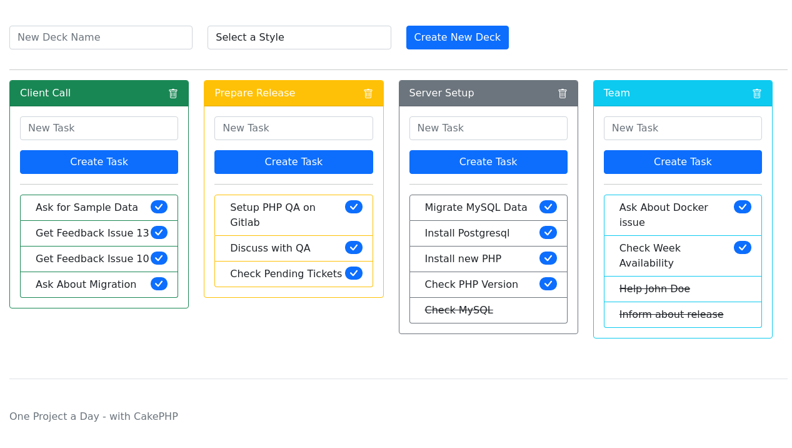

# One CakePHP project a day challenge - Day 11 Tasks

On this project I'm using CakePHP 4, CakeDC/Users plugin and Bootstrap 5

## Steps to create this project
- ee6f1ec Init with base app and bootstrap 5
- 3e1eefd Added users plugin
- bd41f19 Created Main Models:
  ```
  bin/cake bake migration CreateDecks name style user_id:uuid created
  bin/cake bake migration CreateTasks id:uuid name completed:boolean deck_id:uuid created
  bin/cake migrations migrate
  bin/cake bake model Decks
  bin/cake bake model Tasks
  ```
- fe5866f Added page to show and add decks
- fbc3cf8 Show tasks in deck page and allow to add task
- 93ecf60 Added action to mark a task as completed
- d8f702c Improved layout
- 6aef681 Set home route
- 99200fd Show completed tasks at end and sort deck by name

## Result


